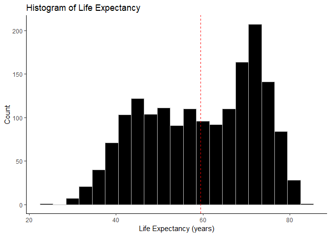
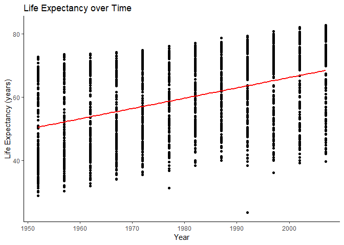
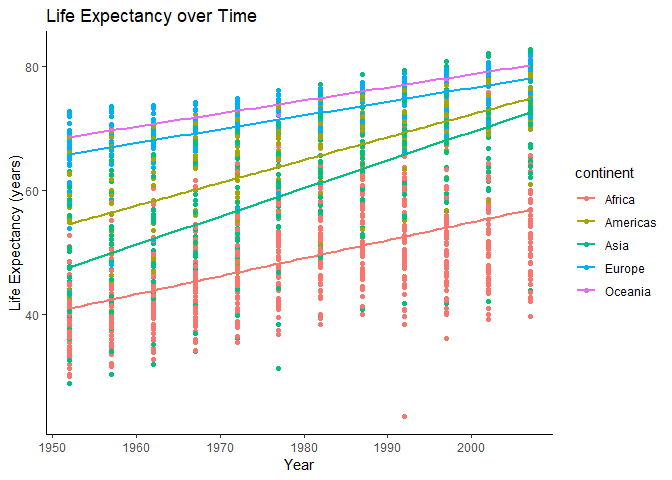
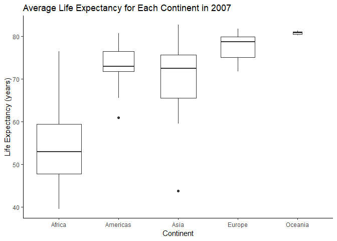

Homework 02: Explore Gapminder and use dplyr
================
Jessica Schaub
September 19, 2018

Overview
--------

This is an R Markdown file for Homework 02, with the purpose of exploring the `gapminder` dataset using `dplyr`and `ggplot`.

Load Gapminder Data
-------------------

Using the library function, we can load our `gapminder` data series and the `tidyverse` package that contains `ggplot` and `dplyr`.

Explore Gapminder
-----------------

Here, we will examine the gapminder object using a variety of functions. First, let's explore using base functions in R:

``` r
# What type of object
typeof(gapminder)
```

    ## [1] "list"

``` r
#class of object
class(gapminder)
```

    ## [1] "tbl_df"     "tbl"        "data.frame"

Using the `class()` and `typeof()` functions, we learn that `gapminder` is a list, which is an object that contains different types of data (numerical, character, vectors, etc...) We also learned that `gapminder` has three classes: tbl\_df, tbl, and data.frame.

Now let's examine the data and format of `gapminder`:

``` r
#glimpse shows useful info about object, dplyr function
glimpse(gapminder)
```

    ## Observations: 1,704
    ## Variables: 6
    ## $ country   <fct> Afghanistan, Afghanistan, Afghanistan, Afghanistan, ...
    ## $ continent <fct> Asia, Asia, Asia, Asia, Asia, Asia, Asia, Asia, Asia...
    ## $ year      <int> 1952, 1957, 1962, 1967, 1972, 1977, 1982, 1987, 1992...
    ## $ lifeExp   <dbl> 28.801, 30.332, 31.997, 34.020, 36.088, 38.438, 39.8...
    ## $ pop       <int> 8425333, 9240934, 10267083, 11537966, 13079460, 1488...
    ## $ gdpPercap <dbl> 779.4453, 820.8530, 853.1007, 836.1971, 739.9811, 78...

Using this one table, we can answer many questions about the data.

-   There are 6 variable/columns
-   There are 1704 observations/rows
-   Country & continent are factors, year & population are integers, and life expectancy and gdp per capita are doubles

Of course, there are other functions that we can use to examine the data. Nrow and ncol can be used for a simple printout, and are useful if that is the only information you are looking for.

``` r
nrow(gapminder)
```

    ## [1] 1704

``` r
ncol(gapminder)
```

    ## [1] 6

We can also print the data out, which gives us information on the data type of variables. We can also count rows and columns ourselves with this view, but it's difficult to imagine a scenario where that would be useful.

``` r
print(gapminder)
```

    ## # A tibble: 1,704 x 6
    ##    country     continent  year lifeExp      pop gdpPercap
    ##    <fct>       <fct>     <int>   <dbl>    <int>     <dbl>
    ##  1 Afghanistan Asia       1952    28.8  8425333      779.
    ##  2 Afghanistan Asia       1957    30.3  9240934      821.
    ##  3 Afghanistan Asia       1962    32.0 10267083      853.
    ##  4 Afghanistan Asia       1967    34.0 11537966      836.
    ##  5 Afghanistan Asia       1972    36.1 13079460      740.
    ##  6 Afghanistan Asia       1977    38.4 14880372      786.
    ##  7 Afghanistan Asia       1982    39.9 12881816      978.
    ##  8 Afghanistan Asia       1987    40.8 13867957      852.
    ##  9 Afghanistan Asia       1992    41.7 16317921      649.
    ## 10 Afghanistan Asia       1997    41.8 22227415      635.
    ## # ... with 1,694 more rows

Overall, the `dplyr` function `glimpse()` was most useful for examining the data.

Explore Individual Variables
----------------------------

### Categorical Variables

Continent and Country are both categorical variables in `gapminder`. Let's examine the number of possible values:

``` r
#n_distinct gives the number of distinct values within a variable
n_distinct(gapminder$continent)
```

    ## [1] 5

``` r
n_distinct(gapminder$country)
```

    ## [1] 142

Since there are a large number of possible values for country, we will choose continent as our categorical variable. The smaller number of values will make plotting cleaner and easier. Let's view the specific values of continent:

``` r
#Levels prints out every unique value for categorical variables
levels(gapminder$continent)
```

    ## [1] "Africa"   "Americas" "Asia"     "Europe"   "Oceania"

### Quantitative Variable

The other four variables are quantitative: year, population, GDP per capita, and life expectancy. We can examine the range of each variable:

``` r
#min and max values for year
paste("Year: min = ",min(gapminder$year),", max = ",max(gapminder$year))
```

    ## [1] "Year: min =  1952 , max =  2007"

``` r
#min and max values for population
paste("Population: min = ",min(gapminder$pop),", max = ",max(gapminder$pop))
```

    ## [1] "Population: min =  60011 , max =  1318683096"

``` r
#min and max values for GDP per capita
paste("GDP per Capita: min = ",min(gapminder$gdpPercap),", max = ",max(gapminder$gdpPercap))
```

    ## [1] "GDP per Capita: min =  241.1658765 , max =  113523.1329"

``` r
#min and max values for life expectancy
paste("Life Expectancy: min = ",min(gapminder$lifeExp),", max = ",max(gapminder$lifeExp))
```

    ## [1] "Life Expectancy: min =  23.599 , max =  82.603"

Life expectancy has a nice range that can also provide informative results, so we can use this as our numerical variable. Let's examine Life Expectancy a bit closer:

``` r
#plotting life expectancy as a histogram to examine spread and distribution
ggplot(data=gapminder, aes(x=lifeExp)) +
  geom_histogram(binwidth = 3, fill="black", col="grey") +
  geom_vline(aes(xintercept=mean(gapminder$lifeExp)), color="red", linetype="dashed") +
  ylab("Count") + 
  xlab("Life Expectancy (years)") + 
  ggtitle("Histogram of Life Expectancy") +
  theme_classic()
```



``` r
#red dashed line for mean
```

This histogram shows the distribution of the variable, and the mean is indicated by the dashed red line. For more information on the statistics of the variable, we can print a summary:

``` r
summary(gapminder$lifeExp)
```

    ##    Min. 1st Qu.  Median    Mean 3rd Qu.    Max. 
    ##   23.60   48.20   60.71   59.47   70.85   82.60

Explore Plot Types
------------------

### Two numerical variables

In this section, we will explore the relationship between year and life expectancy to see how life expectancy has changed with time.

``` r
ggplot(data=gapminder, aes(x=year,y=lifeExp)) +
  geom_point() +
  geom_smooth(method='lm', se=FALSE, color='red') +
  xlab("Year") + ylab("Life Expectancy (years)") + ggtitle("Life Expectancy over Time") +
  theme_classic()
```



This plot shows that life expectancy has increased with time across the whole world. Now let's look at the trends in each continent to see if there are new patterns.

``` r
ggplot(data=gapminder, aes(x=year,y=lifeExp, fill=continent, color=continent)) +
  geom_point() +
  geom_smooth(method='lm', se=FALSE) +
  xlab("Year") + ylab("Life Expectancy (years)") + ggtitle("Life Expectancy over Time") +
  theme_classic()
```



From this graph, we can gather more information. For example, Africa has consistently shown the lowest life expectancy and had the slowest increase over time. Asia has the fastest increase in life expectancy since 1951. Meanwhile, Oceania has consistently shown the highest life expectancy.

### One numerical and one categorical variable

In this section, we will explore the relationship between life expectancy and continent for the year 2007.

``` r
#obtain values for 2007
gapminder %>% 
  filter(year==2007) %>% #pipe into ggplot
  ggplot(aes(x=continent, y=lifeExp)) +
  geom_boxplot(varwidth = TRUE) +
  xlab("Continent") + ylab("Life Expectancy (years)") +
  ggtitle("Average Life Expectancy for Each Continent in 2007") +
  theme_classic()
```



This box plot gives important statistical information, including mean and quantiles. The width of the box also represents the relative number of observations for each continent.

Practice with Piping, Filtering, and Selecting
----------------------------------------------

Some of `dplyr`'s most useful functions include `filter()`, `select()`, and the ability to pipe with `%>%`.

We can filter for specific rows:

``` r
#filter for something simple, like Canada
filter(gapminder, country=="Canada")
```

    ## # A tibble: 12 x 6
    ##    country continent  year lifeExp      pop gdpPercap
    ##    <fct>   <fct>     <int>   <dbl>    <int>     <dbl>
    ##  1 Canada  Americas   1952    68.8 14785584    11367.
    ##  2 Canada  Americas   1957    70.0 17010154    12490.
    ##  3 Canada  Americas   1962    71.3 18985849    13462.
    ##  4 Canada  Americas   1967    72.1 20819767    16077.
    ##  5 Canada  Americas   1972    72.9 22284500    18971.
    ##  6 Canada  Americas   1977    74.2 23796400    22091.
    ##  7 Canada  Americas   1982    75.8 25201900    22899.
    ##  8 Canada  Americas   1987    76.9 26549700    26627.
    ##  9 Canada  Americas   1992    78.0 28523502    26343.
    ## 10 Canada  Americas   1997    78.6 30305843    28955.
    ## 11 Canada  Americas   2002    79.8 31902268    33329.
    ## 12 Canada  Americas   2007    80.7 33390141    36319.

``` r
#filter for all Oceania and Africa data before 1977
filter(gapminder, continent %in% c('Oceania','Africa'), year < 1977)
```

    ## # A tibble: 270 x 6
    ##    country continent  year lifeExp      pop gdpPercap
    ##    <fct>   <fct>     <int>   <dbl>    <int>     <dbl>
    ##  1 Algeria Africa     1952    43.1  9279525     2449.
    ##  2 Algeria Africa     1957    45.7 10270856     3014.
    ##  3 Algeria Africa     1962    48.3 11000948     2551.
    ##  4 Algeria Africa     1967    51.4 12760499     3247.
    ##  5 Algeria Africa     1972    54.5 14760787     4183.
    ##  6 Angola  Africa     1952    30.0  4232095     3521.
    ##  7 Angola  Africa     1957    32.0  4561361     3828.
    ##  8 Angola  Africa     1962    34    4826015     4269.
    ##  9 Angola  Africa     1967    36.0  5247469     5523.
    ## 10 Angola  Africa     1972    37.9  5894858     5473.
    ## # ... with 260 more rows

We can also select different columns:

``` r
#select for only gdpPercap and continent
select(gapminder, gdpPercap, continent)
```

    ## # A tibble: 1,704 x 2
    ##    gdpPercap continent
    ##        <dbl> <fct>    
    ##  1      779. Asia     
    ##  2      821. Asia     
    ##  3      853. Asia     
    ##  4      836. Asia     
    ##  5      740. Asia     
    ##  6      786. Asia     
    ##  7      978. Asia     
    ##  8      852. Asia     
    ##  9      649. Asia     
    ## 10      635. Asia     
    ## # ... with 1,694 more rows

``` r
#or we can select only columns that contain the letter E
select(gapminder,contains("e"))
```

    ## # A tibble: 1,704 x 4
    ##    continent  year lifeExp gdpPercap
    ##    <fct>     <int>   <dbl>     <dbl>
    ##  1 Asia       1952    28.8      779.
    ##  2 Asia       1957    30.3      821.
    ##  3 Asia       1962    32.0      853.
    ##  4 Asia       1967    34.0      836.
    ##  5 Asia       1972    36.1      740.
    ##  6 Asia       1977    38.4      786.
    ##  7 Asia       1982    39.9      978.
    ##  8 Asia       1987    40.8      852.
    ##  9 Asia       1992    41.7      649.
    ## 10 Asia       1997    41.8      635.
    ## # ... with 1,694 more rows

Piping also allows us to combine these functions and subset our data very specifically and efficiently:

``` r
#Find all values for Zimbabwe between 1975 and 2000, and only plot variables that contain the letter 'r'
gapminder %>% 
  filter(country == 'Zimbabwe', year %in% c(1975:2000)) %>% 
  select(contains("r"))
```

    ## # A tibble: 5 x 3
    ##   country   year gdpPercap
    ##   <fct>    <int>     <dbl>
    ## 1 Zimbabwe  1977      686.
    ## 2 Zimbabwe  1982      789.
    ## 3 Zimbabwe  1987      706.
    ## 4 Zimbabwe  1992      693.
    ## 5 Zimbabwe  1997      792.
